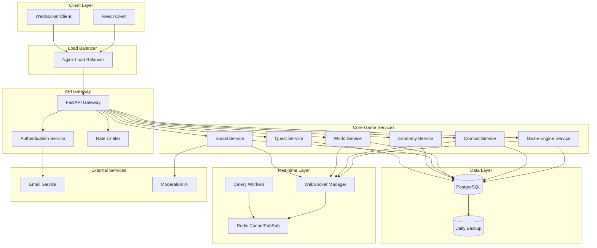
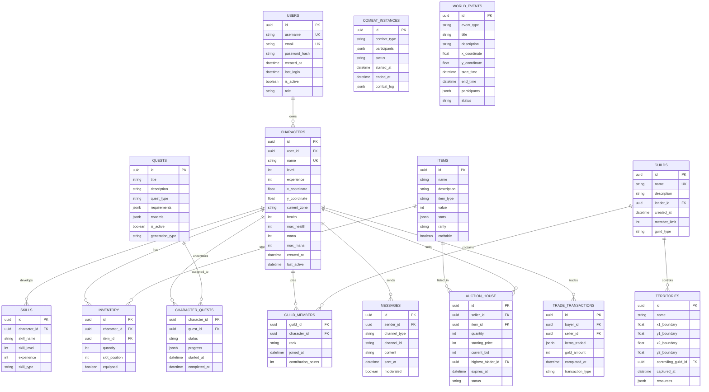
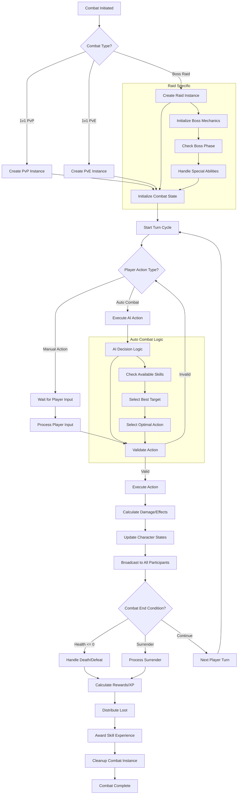
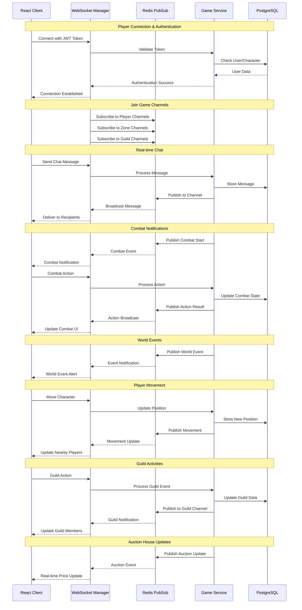
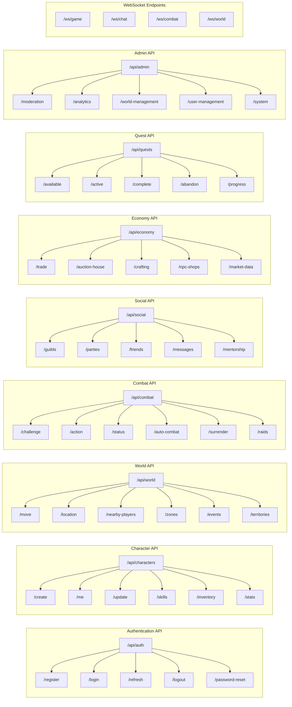
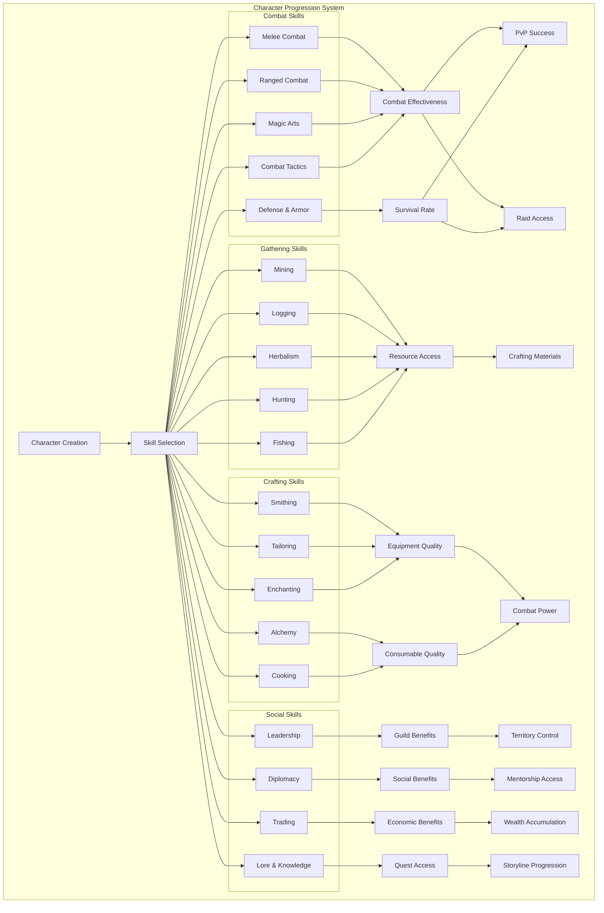
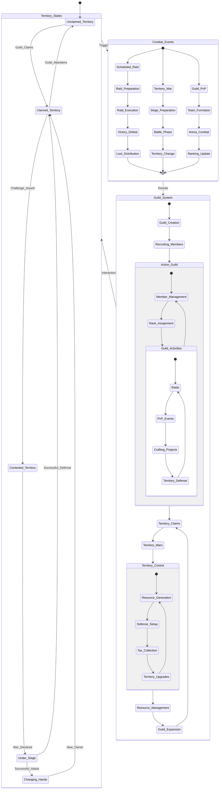

# Technical Architecture Diagrams

## System Architecture Overview

### High-Level System Architecture

## Database Entity Relationship Diagram

## Combat System Flow

## Real-Time Communication Sequence

## API Structure Overview

## Character Progression System

## Guild and Territory Control State Diagram

## Technical Implementation Notes

### Database Indexing Strategy
- **Spatial Indexes**: x_coordinate, y_coordinate for world queries
- **Temporal Indexes**: created_at, last_active for time-based queries
- **Composite Indexes**: (character_id, skill_name) for skill lookups
- **Full-text Indexes**: message content for search functionality

### Performance Optimization
- **Connection Pooling**: 20 connections per service instance
- **Query Optimization**: Use EXPLAIN for all complex queries
- **Caching Strategy**: 5-minute TTL for character data, 1-minute for world state
- **Background Processing**: Use Celery for non-critical operations

### Security Considerations
- **Input Validation**: All user inputs validated with Pydantic models
- **SQL Injection Prevention**: Parameterized queries only
- **Rate Limiting**: 100 requests per minute per authenticated user
- **WebSocket Security**: JWT validation on connection and periodic re-validation

### Monitoring Requirements
- **Response Time Tracking**: 95th percentile under 100ms
- **Error Rate Monitoring**: Alert on >1% error rate
- **Concurrent User Tracking**: Real-time player count dashboard
- **Database Performance**: Query execution time monitoring
- **Memory Usage**: Alert on >80% memory utilization 